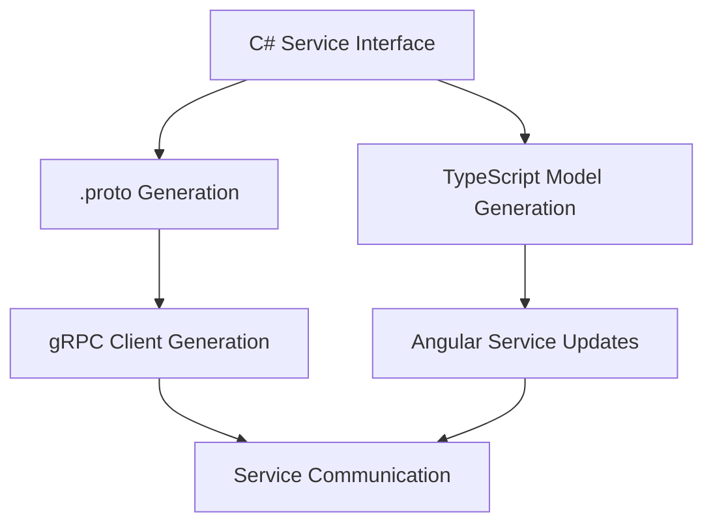

# Event Management System - Developer Quickstart

**Date**: 2025-12-30  
**Feature**: Event Management System  
**Phase**: 1 - Development Setup

## Prerequisites

- **.NET 8.0 SDK** - Latest version with Aspire workload
- **Node.js 18+** - For Angular development
- **SQL Server** - LocalDB or full instance
- **Docker Desktop** - For containerized dependencies
- **Visual Studio 2022** or **VS Code** - With C# and Angular extensions

### Install .NET Aspire Workload
```bash
dotnet workload install aspire
```

### Global Tools
```bash
dotnet tool install -g dotnet-ef
npm install -g @angular/cli@17
```

## Solution Structure

```
AngularAspire/
├── src/
│   ├── EventManagement.AppHost/           # Aspire orchestration
│   ├── EventManagement.ServiceDefaults/   # Shared service configuration
│   │
│   ├── Services/                          # Business Services (IDesign)
│   │   ├── EventManagement.Api/           # Event management service
│   │   ├── Registration.Api/              # Registration service
│   │   ├── SessionManagement.Api/         # Session management service
│   │   ├── UserManagement.Api/            # User management service
│   │   └── Notification.Api/              # Notification service
│   │
│   ├── Gateways/                          # API Gateways
│   │   ├── Public.Gateway/                # Public API gateway
│   │   └── Admin.Gateway/                 # Admin API gateway
│   │
│   ├── Apps/                              # Frontend Applications
│   │   ├── PublicApp/                     # Public Angular app
│   │   └── AdminApp/                      # Admin Angular app
│   │
│   ├── Shared/                            # Shared Libraries
│   │   ├── EventManagement.Contracts/     # gRPC contracts
│   │   ├── EventManagement.Domain/        # Domain models
│   │   └── EventManagement.Infrastructure/ # Shared infrastructure
│   │
│   └── Tests/                             # Test Projects
│       ├── EventManagement.Tests/         # Unit tests
│       ├── Integration.Tests/             # Integration tests
│       └── E2E.Tests/                     # Playwright tests
└── docs/                                  # Documentation
```

## 5-Minute Startup

### 1. Clone and Setup
```bash
git clone https://github.com/yourorg/angularaspire.git
cd angularaspire
```

### 2. Create Solution and Projects
```bash
# Create solution
dotnet new sln -n EventManagement

# Aspire orchestration
dotnet new aspire-apphost -n EventManagement.AppHost
dotnet new aspire-servicedefaults -n EventManagement.ServiceDefaults

# Business services
dotnet new webapi -n EventManagement.Api
dotnet new webapi -n Registration.Api
dotnet new webapi -n SessionManagement.Api  
dotnet new webapi -n UserManagement.Api
dotnet new webapi -n Notification.Api

# API Gateways
dotnet new webapi -n Public.Gateway
dotnet new webapi -n Admin.Gateway

# Shared libraries
dotnet new classlib -n EventManagement.Contracts
dotnet new classlib -n EventManagement.Domain
dotnet new classlib -n EventManagement.Infrastructure

# Angular apps
ng new PublicApp --routing --style=scss --standalone
ng new AdminApp --routing --style=scss --standalone

# Test projects
dotnet new xunit -n EventManagement.Tests
dotnet new xunit -n Integration.Tests
dotnet new mstest -n E2E.Tests

# Add all to solution
dotnet sln add **/*.csproj
```

### 3. Configure Aspire Orchestration
Update `EventManagement.AppHost/Program.cs`:

```csharp
var builder = DistributedApplication.CreateBuilder(args);

// Infrastructure
var sqlserver = builder.AddSqlServer("sqlserver")
    .WithDataVolume()
    .AddDatabase("eventdb");

var redis = builder.AddRedis("redis")
    .WithDataVolume();

var storage = builder.AddAzureStorage("storage")
    .RunAsEmulator()
    .AddBlobs("blobs");

// Business Services
var eventService = builder.AddProject<Projects.EventManagement_Api>("eventmanagement-api")
    .WithReference(sqlserver)
    .WithReference(redis);

var registrationService = builder.AddProject<Projects.Registration_Api>("registration-api")
    .WithReference(sqlserver)
    .WithReference(redis);

var sessionService = builder.AddProject<Projects.SessionManagement_Api>("sessionmanagement-api")
    .WithReference(sqlserver)
    .WithReference(redis);

var userService = builder.AddProject<Projects.UserManagement_Api>("usermanagement-api")
    .WithReference(sqlserver)
    .WithReference(redis);

var notificationService = builder.AddProject<Projects.Notification_Api>("notification-api")
    .WithReference(redis)
    .WithReference(storage);

// API Gateways
var publicGateway = builder.AddProject<Projects.Public_Gateway>("public-gateway")
    .WithReference(eventService)
    .WithReference(registrationService)
    .WithReference(sessionService)
    .WithReference(userService);

var adminGateway = builder.AddProject<Projects.Admin_Gateway>("admin-gateway")
    .WithReference(eventService)
    .WithReference(registrationService)
    .WithReference(sessionService)
    .WithReference(userService)
    .WithReference(notificationService);

// Frontend Applications  
builder.AddNpmApp("publicapp", "../Apps/PublicApp")
    .WithReference(publicGateway)
    .WithHttpEndpoint(env: "API_URL");

builder.AddNpmApp("adminapp", "../Apps/AdminApp")
    .WithReference(adminGateway)
    .WithHttpEndpoint(env: "API_URL");

builder.Build().Run();
```

### 4. Start Development Environment
```bash
# Terminal 1: Start Aspire orchestration
cd src/EventManagement.AppHost
dotnet run

# This will start:
# - SQL Server container
# - Redis container  
# - All .NET APIs
# - Angular development servers
# - Aspire dashboard at http://localhost:15888
```

### 5. Verify Setup
- **Aspire Dashboard**: http://localhost:15888
- **Public App**: http://localhost:4200
- **Admin App**: http://localhost:4201
- **Public API**: http://localhost:5001/swagger
- **Admin API**: http://localhost:5002/swagger

## Database Setup

### Entity Framework Configuration
Add to each service's `Program.cs`:

```csharp
builder.AddServiceDefaults();

// Entity Framework with SQL Server
builder.Services.AddDbContext<EventDbContext>(options =>
    options.UseSqlServer(builder.Configuration.GetConnectionString("eventdb")));

// Redis caching
builder.AddRedisOutputCache("redis");
builder.Services.AddStackExchangeRedisCache(options => {
    options.Configuration = builder.Configuration.GetConnectionString("redis");
});

var app = builder.Build();
app.MapDefaultEndpoints();
```

### Database Migrations
```bash
# EventManagement.Api
cd src/Services/EventManagement.Api
dotnet ef migrations add InitialCreate
dotnet ef database update

# Registration.Api  
cd ../Registration.Api
dotnet ef migrations add InitialCreate
dotnet ef database update

# Repeat for other services...
```

## gRPC Service Communication

### Configure gRPC Client in Gateway
`Public.Gateway/Program.cs`:

```csharp
builder.Services.AddGrpcClient<EventService.EventServiceClient>(options => {
    options.Address = new Uri("https://eventmanagement-api");
});

builder.Services.AddGrpcClient<RegistrationService.RegistrationServiceClient>(options => {
    options.Address = new Uri("https://registration-api");  
});
```

### Add gRPC Service in Business Service
`EventManagement.Api/Program.cs`:

```csharp
builder.Services.AddGrpc();

var app = builder.Build();
app.MapGrpcService<EventGrpcService>();
```

## Angular App Setup

### Install Dependencies
```bash
# PublicApp
cd src/Apps/PublicApp
npm install @angular/material @angular/cdk
npm install @ngrx/store @ngrx/effects @ngrx/store-devtools
npm install rxjs axios

# AdminApp
cd ../AdminApp  
npm install @angular/material @angular/cdk
npm install @ngrx/store @ngrx/effects @ngrx/store-devtools
npm install rxjs axios ag-grid-angular
```

### Configure Environment
`src/Apps/PublicApp/src/environments/environment.ts`:

```typescript
export const environment = {
  production: false,
  apiUrl: 'http://localhost:5001/api/v1',
  features: {
    registration: true,
    socialEvents: true
  }
};
```

### HTTP Interceptor for API Calls
```typescript
@Injectable()
export class ApiInterceptor implements HttpInterceptor {
  intercept(req: HttpRequest<any>, next: HttpHandler): Observable<HttpEvent<any>> {
    const apiReq = req.clone({
      url: `${environment.apiUrl}${req.url}`,
      setHeaders: {
        'Content-Type': 'application/json'
      }
    });
    
    return next.handle(apiReq);
  }
}
```

## Testing Setup

### Unit Testing
```bash
# .NET Tests
cd src/Tests/EventManagement.Tests
dotnet test

# Angular Tests
cd src/Apps/PublicApp
npm run test
```

### Integration Testing
`Integration.Tests/EventApiTests.cs`:

```csharp
public class EventApiTests : IClassFixture<WebApplicationFactory<Program>>
{
    [Fact]
    public async Task GetEvents_ReturnsEvents()
    {
        // Arrange
        var client = _factory.CreateClient();
        
        // Act  
        var response = await client.GetAsync("/api/v1/events");
        
        // Assert
        response.EnsureSuccessStatusCode();
        var events = await response.Content.ReadFromJsonAsync<EventListResponse>();
        Assert.NotNull(events);
    }
}
```

### E2E Testing with Playwright
```bash
cd src/Tests/E2E.Tests
npx playwright install
npx playwright test
```

## Development Workflow

### 1. Feature Development
1. Create feature branch: `git checkout -b feature/event-registration`
2. Update C# service interfaces if needed (auto-generates .proto files)
3. Run code generation: `dotnet build` (regenerates .proto and TypeScript models)
4. Implement backend service changes
5. Update API gateway if needed
6. Implement frontend changes (using generated TypeScript models)
7. Add tests at all layers
8. Verify with Aspire dashboard

### 2. Database Changes
```bash
# Add migration
dotnet ef migrations add AddEventStatus --project EventManagement.Api

# Update database
dotnet ef database update --project EventManagement.Api

# Update other services as needed
```

### 3. Service Contract Changes
1. Update C# interfaces in `EventManagement.Contracts` project
2. Build solution to regenerate .proto files and TypeScript models: `dotnet build`
3. Update OpenAPI specs are auto-generated from controllers
4. Update Angular services to use generated TypeScript models
5. Update tests to match new contracts

### 4. Code Generation Setup
```bash
# Add to EventManagement.Contracts project
dotnet add package protobuf-net.Grpc
dotnet add package NSwag.MSBuild

# Configure MSBuild for automatic generation
# Generates TypeScript models on build
```

**Code Generation Workflow**:


### 4. Frontend Development
```bash
# Generate Angular components
ng generate component events/event-list --standalone
ng generate service services/event-api

# Generate NgRx state management
ng generate @ngrx/schematics:feature events --reducers ../state/app.state.ts
```

## Production Deployment

### Container Registry
```bash
# Build and push services
dotnet publish --os linux --arch x64 -p:PublishProfile=DefaultContainer
docker push myregistry/eventmanagement-api:latest

# Build and push Angular apps
ng build --prod
docker build -t myregistry/publicapp:latest .
docker push myregistry/publicapp:latest
```

### Azure Container Apps
Deploy via Aspire:
```bash
dotnet run --publisher azd
```

## Troubleshooting

### Common Issues
1. **Aspire services not starting**: Check Docker Desktop is running
2. **Angular apps not loading**: Verify Node.js version >= 18
3. **Database connection errors**: Confirm SQL Server container is healthy
4. **gRPC communication failures**: Check service discovery configuration
5. **CORS issues**: Configure CORS policies in gateway services

### Useful Commands
```bash
# View Aspire logs
dotnet run --project EventManagement.AppHost --verbosity detailed

# Reset databases  
dotnet ef database drop --project EventManagement.Api
dotnet ef database update --project EventManagement.Api

# Clear Angular cache
ng cache clean

# View container logs
docker logs aspire-sql-1
```

### Performance Monitoring
- **Aspire Dashboard**: Real-time service metrics
- **Application Insights**: Production telemetry
- **OpenTelemetry**: Distributed tracing
- **Prometheus**: Custom metrics collection

## Next Steps

1. **Complete the data models** - Implement Entity Framework entities
2. **Add authentication** - JWT tokens with role-based access
3. **Implement caching** - Redis for frequently accessed data  
4. **Add validation** - FluentValidation for robust input validation
5. **Performance optimization** - Query optimization and connection pooling
6. **Security hardening** - Input sanitization and rate limiting

This quickstart gets you running with a fully orchestrated, production-ready architecture following IDesign principles and constitutional requirements.