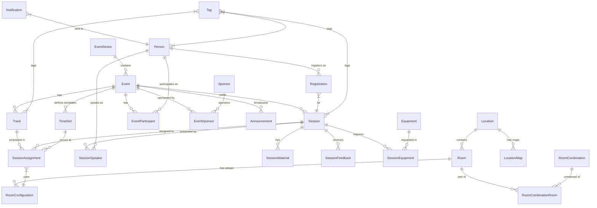

# Data Model: Event Administration

**Feature**: Event Administration UI
**Branch**: `003-event-admin-ui`

## Entity Relationship Diagram (Mermaid)

## Entities

### Event Management

**EventSeries**
- Id (UUIDv7)
- Name, Description, Slug
- LogoUrl
- Audit Columns

**Event**
- Id (UUIDv7)
- SeriesId (FK, nullable)
- ShortCode (Unique, e.g., "EVT-2026-001")
- Name, Description
- StartDate, EndDate (UTC)
- TimeZoneId
- Status (Draft, Published, Active, Completed, Cancelled, Archived)
- Visibility (Public, Private)
- IsHybrid (bool)
- Branding (Logo, Colors)
- Audit Columns

**Track**
- Id (UUIDv7)
- EventId (FK)
- Name, Description
- Color
- Order
- Audit Columns

**TimeSlot**
- Id (UUIDv7)
- EventId (FK)
- Name (e.g., "Morning Keynote", "Session Block 1")
- StartTime, EndTime (UTC)
- Type (Session, Break, Lunch, Keynote)
- IsEventLevel (bool)
- Audit Columns

**Announcement**
- Id (UUIDv7)
- EventId (FK)
- Title, Content (Rich Text)
- Priority (High, Normal, Low)
- PublishAt, ExpireAt (UTC)
- TargetScope (All, Attendees, Speakers, Track)
- Audit Columns

### Session Management

**Session**
- Id (UUIDv7)
- EventId (FK)
- ShortCode (Unique, e.g., "SES-ABC123")
- Title, Abstract
- Status (Draft, Scheduled, Cancelled)
- Flags (IsConfirmed, IsPublished)
- Duration (minutes)
- Level (Beginner, Intermediate, Advanced)
- Language
- Capacity (override)
- SubmissionStatus (NotSubmitted, Submitted, UnderReview, Accepted, Rejected)
- Audit Columns

**SessionAssignment**
- Id (UUIDv7)
- SessionId (FK)
- TrackId (FK)
- TimeSlotId (FK)
- RoomConfigurationId (FK, nullable)
- RoomSnapshot (JSON)
- Audit Columns
- *Note: For sessions spanning multiple slots, this record represents the start. Duration is derived from Session.Duration.*

**SessionSpeaker**
- SessionId (FK)
- PersonId (FK)
- Role (Primary, Co-Speaker, Moderator)
- IsConfirmed (bool)

**SessionEquipment**
- SessionId (FK)
- EquipmentId (FK)
- Quantity
- Audit Columns

### Infrastructure

**Location**
- Id (UUIDv7)
- Name, Address
- Audit Columns

**LocationMap**
- Id (UUIDv7)
- LocationId (FK)
- Name (e.g., "Ground Floor")
- MapUrl
- Audit Columns

**Room**
- Id (UUIDv7)
- LocationId (FK)
- Name
- Capacity (default)
- Accessibility (Tags/Flags: Wheelchair, HearingLoop, etc.)
- Audit Columns

**RoomConfiguration**
- Id (UUIDv7)
- RoomId (FK)
- Name (Theater, Classroom, etc.)
- Capacity
- Audit Columns

**RoomCombination**
- Id (UUIDv7)
- Name
- Capacity
- Audit Columns
- *Note: Capacity is explicitly defined for the combination, not just a sum.*

**Equipment**
- Id (UUIDv7)
- Name, Description
- Category (AV, Furniture, Network, etc.)
- Audit Columns

### People & Registration

**Person**
- Id (UUIDv7)
- Name, Email
- Bio, PhotoUrl, Company
- UserId (Identity Link)
- Audit Columns

**EventParticipant**
- EventId (FK)
- PersonId (FK)
- Roles (Flags: Attendee, Speaker, Organizer)

**Registration**
- Id (UUIDv7)
- SessionId (FK)
- PersonId (FK)
- Status (Registered, Waitlisted, Cancelled)
- Position (int, for waitlist)
- RegisteredAt (Timestamp)
- Audit Columns

### Content & Feedback

**SessionMaterial**
- Id (UUIDv7)
- SessionId (FK)
- Name, Type (Slides, Code, etc.)
- Url, SizeBytes
- Visibility (Public, Attendees)
- Audit Columns

**SessionFeedback**
- Id (UUIDv7)
- SessionId (FK)
- PersonId (FK)
- Rating (1-5)
- Comment (text)
- SubmittedAt
- Audit Columns
- *Constraint: Unique per SessionId + PersonId*

### Sponsorship

**Sponsor**
- Id (UUIDv7)
- Name, Description
- LogoUrl, WebsiteUrl
- Audit Columns

**EventSponsor**
- EventId (FK)
- SponsorId (FK)
- Tier (Platinum, Gold, Silver, Bronze)
- SortOrder
- Audit Columns

### Metadata

**Tag**
- Id (UUIDv7)
- Name
- Type (Subject, Technology, Audience)
- Audit Columns

### System

**AuditLog**
- Id (UUIDv7)
- EntityType, EntityId
- Action (Create, Update, Delete)
- Changes (JSON: Old/New values)
- UserId (FK)
- Timestamp
- IPAddress

**Notification**
- Id (UUIDv7)
- PersonId (FK)
- TargetEntityType (e.g., "Session", "Event")
- TargetEntityId (UUIDv7)
- Type (Email, Push)
- Subject, Body
- Status (Pending, Sent, Failed, Read)
- SentAt, ReadAt
- Audit Columns
